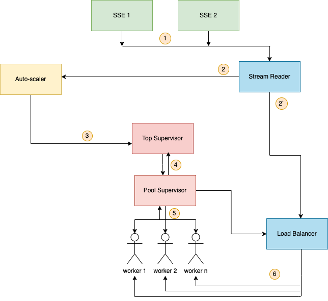
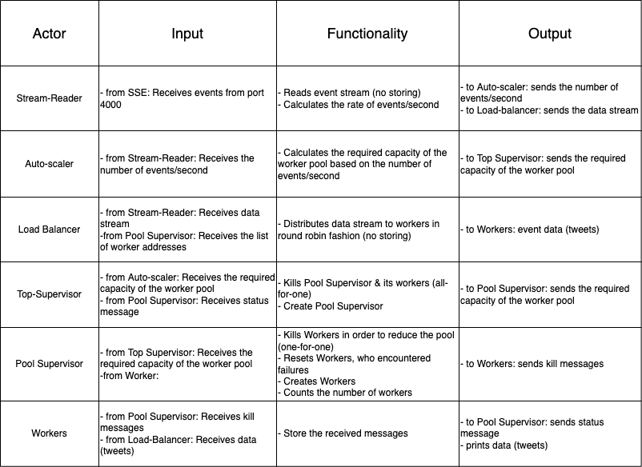

# Agonizing-Dung-Beetle-PTR
## The Task
The task for this laboratory work is to create a steaming analysis system. You’ll be provided
with a Docker image from which you need to read SSE streams containing Tweeter tweets and
process them via a pool of workers. This worker pool needs to be scaled to adapt for the everchanging workload and the load on each worker needs to be balanced. The worker pool needs
to handle actors shutting down. Finally, the system should provide log messages to report its
state. 

## Checkpoint #1
### System Architecture Diagram


### Actors' Endpoints


### Language of Choice: Elixir
### Libraries:
#### Agent
Agents are a simple abstraction around state. Often in Elixir there is a need to share or  
store state that must be accessed from different processes or by the same process at  
different points in time. The `Agent` module provides a basic server implementation that allows  
state to be retrieved and updated via a simple API.

#### Dynamic Supervisor
A `supervisor` that starts children dynamically. The Supervisor module was designed to handle  
mostly static children that are started in the given order when the supervisor starts.  
A `DynamicSupervisor` starts with no children. Instead, children are started on demand via  
`start_child/2`. When a dynamic supervisor terminates, all children are shut down at the same  
time, with no guarantee of ordering.

#### GenServer
A behaviour module for implementing the server of a client-server relation. A GenServer is  
a process like any other Elixir process, and it can be used to keep state, execute code  
asynchronously and so on. The advantage of using a generic server process (GenServer)  
implemented using this module is that it will have a standard set of interface functions and  
include functionality for tracing and error reporting. It will also fit into a supervision tree.

#### Task
Conveniences for spawning and awaiting tasks. Tasks are processes meant to execute one  
particular action throughout their lifetime, often with little or no communication with other  
processes. The most common use case for tasks is to convert sequential code into concurrent  
code by computing a value asynchronously:
```elixir
task = Task.async(fn -> do_some_work() end)
res = do_some_other_work()
res + Task.await(task)
```
Tasks spawned with `async` can be awaited on by their caller process (and only their caller) as  
shown in the example above. They are implemented by spawning a process that sends a message  
to the caller once the given computation is performed. Besides, `async/1` and `await/2`, tasks can also  
be started as part of a supervision tree and dynamically spawned on remote nodes.

#### Task.Supervisor
A task supervisor. This module defines a supervisor which can be used to dynamically supervise tasks.  
A task supervisor is started with no children, often under a supervisor and a name:
```elixir
children = [
  {Task.Supervisor, name: MyApp.TaskSupervisor}
]

Supervisor.start_link(children, strategy: :one_for_one)
```
The options given in the child specification are documented in `start_link/1`.